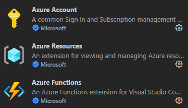
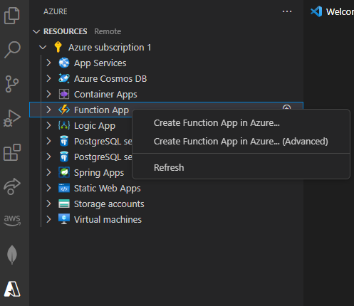
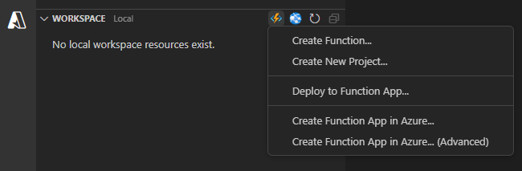
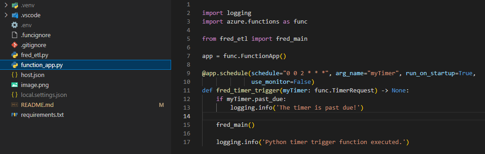
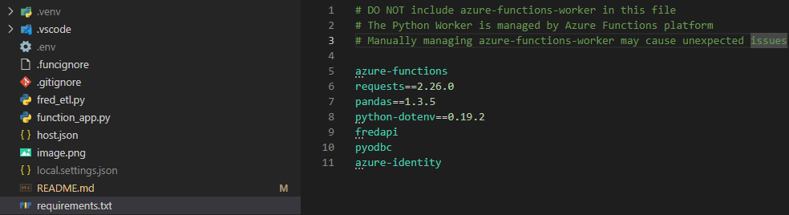
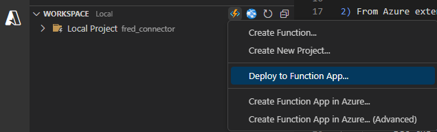

# How to create and deploy an Azure function from VSCode

## Prerequisites:

1) Install ODBC drivers:
   - https://docs.microsoft.com/en-us/sql/connect/odbc/windows/release-notes-odbc-sql-server-windows

2) Install Azure Functions Core Tools:
   - https://learn.microsoft.com/en-us/azure/azure-functions/functions-run-local?tabs=windows%2Cisolated-process%2Cnode-v4%2Cpython-v2%2Chttp-trigger%2Ccontainer-apps&pivots=programming-language-python

4) Download Visual Studio Code extensions for Azure:
    
    - Azure Functions
    - Azure Account
    - Azure Resources
      
    

    Note: Installing Azure Functions should automatically install the other two.

## Steps:

1) From Azure extension/ Resources/ Azure Subscription/ Function App: create Function app

    

2) From Azure extension/ Workspace Create Function:
   
    

    - Select the folder that will contain your project
    - Select language: Python
    - Select Python programming model: Model V2
    - Select a Python interpreter to create a virtual enviroment: Python3.10
    - Select a template for your project first function: Timer Trigger
    - Give a name to your function
    - Enter a cron expression to specify the schedule: for example for running at 2 am every day "0 0 2 * * *"

3) Add code to the function_app.py file

    

4) Complete the requirements.txt file:

    

5) Deploy it to the correspondent function app
  
   

For more information check the official documentation:
https://learn.microsoft.com/en-us/azure/azure-functions/functions-develop-vs-code?tabs=node-v3%2Cpython-v2%2Cisolated-process&pivots=programming-language-python#debugging-functions-locally

